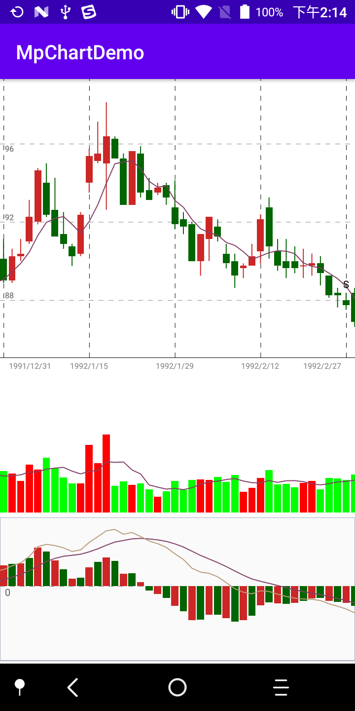

# MpChartDemo
实现简单的MpChart联动

#### 相关的参考
* [KlineChart-master](https://github.com/gogooing/KlineChart-master)
* [多图表交互联动的通用简单方法](https://blog.csdn.net/qq_28844947/article/details/84292337)
* [使用MPAndroidChart实现K线图](https://blog.csdn.net/shilyhm/article/details/81632902)
* [Android图表控件MPAndroidChart——LineChart实现 XY轴、原点线的直尺刻度样式](https://blog.csdn.net/ww897532167/article/details/78520548?utm_medium=distribute.pc_relevant.none-task-blog-baidujs_title-7&spm=1001.2101.3001.4242)
* [在MPAndroidChart库K线图的基础上画均线](https://blog.csdn.net/weixin_34387284/article/details/94474907?utm_medium=distribute.pc_relevant.none-task-blog-BlogCommendFromMachineLearnPai2-1.control&depth_1-utm_source=distribute.pc_relevant.none-task-blog-BlogCommendFromMachineLearnPai2-1.control)
* [MPAndroidChart](https://github.com/PhilJay/MPAndroidChart)